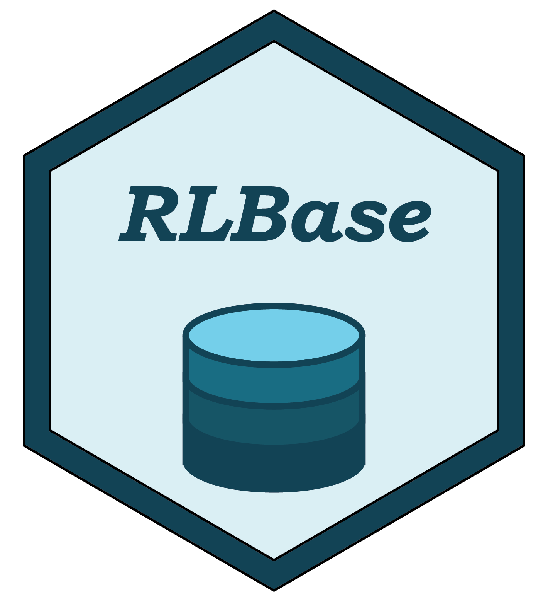
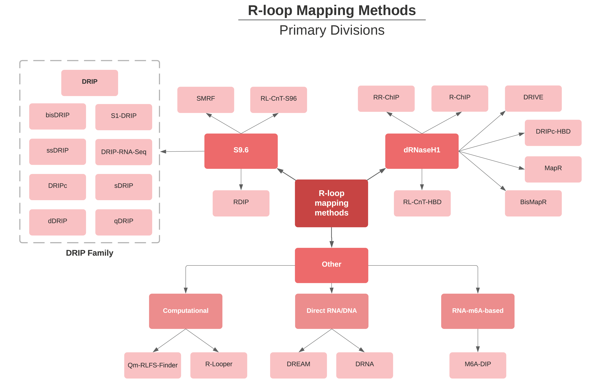

```{r setup, echo=FALSE, include=FALSE}
library(tidyverse)
library(shiny)
source("../utils.R")
```

{align="right" style="border: none; float: right;" width="256"}

**RLBase** is a web database for **accessing, exploring, and analyzing R-loop mapping data.**. Key features:

1.  Explore hundreds of R-loop mapping datasets
2.  Explore R-loop regions (sites of consensus R-loop formation)
3.  Analyze your own R-loop mapping data
4.  Download processed and standardized data sets.

*RLBase* is a core component of [**RLSuite**](https://gccri.bishop-lab.uthscsa.edu/rlsuite/){target="_blank"}, an R-loop analysis software toolchain. **RLSuite** also includes [RLPipes](https://github.com/Bishop-Laboratory/RLPipes){target="_blank"} (a CLI pipeline for upstream R-loop data processing), [RLSeq](https://bishop-laboratory.github.io/RLSeq/){target="_blank"} (an R package for downstream R-loop data analysis), and [RLHub](https://bishop-laboratory.github.io/RLHub/){target="_blank"} (an R package interface to the RLBase datastore).

Our goal in this document is to **(1) Describe the backround and motivation of RLBase, (2) describe the RLBase components in detail, and (3) address other questions which may arise when using RLBase**.

# Background and Motivation

## R-Loops and R-loop mapping

R-loops are three-stranded nucleic acid structures formed from the hybridization of RNA and DNA, typically during transcription [@Niehrs2020]. R-loops have long been studied in the context of pathology, but recent evidence indicates they may play a critical role in normal cell physiology [@Niehrs2020].

{target="_blank"})](https://upload.wikimedia.org/wikipedia/commons/d/d3/R-loop_promoting_factors.jpg){align="right" style="border: none; float: none;" width="560"}

With the advent of DNA-RNA immunoprecipitation sequencing (DRIP-Seq) in 2012, it became possible to map R-loop locations throughout the genome [@Ginno2012]. In the years since, dozens of studies have implemented R-loop mapping approaches and submitted their data to public repositories like the Sequence Read Archive (SRA). In 2021, there are over 43 studies with public data in SRA.

## The RLBase project

We began the *RLBase* project in 2019 with the aim of standardizing public R-loop mapping samples and making the resulting data accessible for R-loop biologists to explore and analyze. Our first publication from this project used over 100 DRIP-Seq data-sets to reveal an unexpected role for physiological R-loops in chromatin architecture [@Pan2020]. Building on this pilot study, we began in 2020 to manually catalog **all** public R-loop mapping samples, finding \> 40 studies and \> 600 data sets. We developed and implemented a light-weight CLI pipeline, [RLPipes](https://github.com/Bishop-Laboratory/RLPipes){target="_blank"}, to automate and standardize the re-processing of these data from raw reads.

Unexpectedly, **we found drastic inconsistency between samples, posing a major hurdle to meta-analysis and exploration of these data**. These findings were recently echoed by *Chedin et al., 2021* in their EMBO commentary [@Chédin2021].

To overcome this limitation, we developed new methods for assessing sample quality (implemented in the [RLSeq](https://bishop-laboratory.github.io/RLSeq/){target="_blank"} R package). We then used these methods to find high-confidence R-loop samples and used them for meta-analysis of R-loop locations (termed "RL regions" here). The processed data generated from these analyses can be accessed via the [RLHub](https://bishop-laboratory.github.io/RLHub/){target="_blank"} R package.

Finally, we built the RLBase web server to facilitate access to these data along with the unique analysis approaches we have developed. In the following section on "RLBase Usage and Interface", we discuss these capabilities further.

# RLBase Usage and Interface

*RLBase* can be used for all of the following:

-   Exploration of R-loop mapping samples ([view](#rlsamples))
    -   Exploration of mapping samples from different modalities
    -   Analysis of sample quality
    -   Analysis of genomic feature enrichment
-   R-loop Region (RL Region) analysis ([link](#rlregions))
    -   Exploration of R-loop regions
    -   Analysis of R-loop region correlation with gene expression
-   User-supplied samples ([view](#userdata))
    -   Analysis of user-supplied data and HTML report with [RLSeq](https://bishop-laboratory.github.io/RLSeq/){target="_blank"}.

## Analysis of RLBase samples {#rlsamples}

The samples in RLBase were standardized and reprocessed using the [*RLPipes*](https://github.com/Bishop-Laboratory/RLPipes){target="_blank"} CLI tool. They were then analyzed with [*RLSeq*](https://bishop-laboratory.github.io/RLSeq/){target="_blank"} which performed (1) R-loop forming sequences analysis, (2) sample quality prediction, (3) genomic feature enrichment analysis, (4) sample-to-sample correlation analysis, (5) gene annotation, and (6) R-loop regions (RL Regions) overlap analysis. See also the `RLSeq::RLSeq()` function  [documentation](https://bishop-laboratory.github.io/RLSeq/reference/RLSeq.html){target="_blank"}.

The metadata from these analyses along with other sample information are provided in the sample data table and can be explored interactively (**Figure 1**).

{align="right" style="border: none; float: none;" width="1000"}

The right-hand side of the Sample page (**Fig. 1C**) displays the plots and data relevant to the samples shown in the table (controlled by "Table Controls" (**Fig. 1A**)) and also by the row selected in the "RLBase Samples Table" (**Fig. 1B**). In the following subsections, we will detail each panel.

### Summary panel

The summary panel provides a high-level overview of all samples in the "RLBase Samples Table" (**Fig. 2B-D**) and also of the specific sample selected in that table (**Fig. 2A**).

{target="_blank"}).](https://rlbase-data.s3.amazonaws.com/misc/assets/rlbase_interface/samples_page__Summary.png){align="right" style="border: none; float: none;"}

### Sample-sample comparison

The "Sample-sample comparison" panel (**Figure 3**) summarizes sample-level similarity using a recently-described correlation method [@Chédin2021]. The method finds the Pearson correlation of R-loop signal around "gold standard" R-loop sites, sites which were profiled with ultra-long-read R-loop mapping (SMRF-Seq) [@Malig2020]. The plots include a heatmap showing the correlation (**Fig 3. A**) along with a PCA plot which shows the first two principal components of the correlation matrix (**Fig. 3B**).

{target="_blank"} for additional detail). (**B**) Similar to (**A**) but with a scatter plot showing PC1 and PC2 from principal component analysis (PCA) of the correlation matrix. Controls allow for customization of the plot.](https://rlbase-data.s3.amazonaws.com/misc/assets/rlbase_interface/samples_page__SampleSample.png){align="right" style="border: none; float: none;"}

### Annotations

Genomic features relevant to R-loops were curated from public data sources or from computational prediction. For a full description of these data, view the relevant section of the [RLHub documentation](https://bishop-laboratory.github.io/RLHub/reference/annotations.html){target="_blank"}. For each sample in RLBase, the called peaks were overlapped with each genomic feature annotation and overlap statistics were calculated using Fisher's exact test. The plots in (**Figure 4**) show the distribution of Fisher's exact test odds ratios for each sample present in the "RLBase Samples Table".

{target="_blank"} for more detail. (**C**) A plot showing the distribution of enrichment results (represented by the log2 Fisher's exact test odds ratio). The sample selected in the table is shown as a diamond (if results are available). Additional information can be found in the [RLSeq Vignette](https://bishop-laboratory.github.io/RLSeq/articles/analyzing-rloop-data-with-rlseq.html#feature-enrichment-1){target="_blank"}](https://rlbase-data.s3.amazonaws.com/misc/assets/rlbase_interface/samples_page__Annotation.png){align="right" style="border: none; float: none;"}

### RLFS analysis results

R-loop forming sequences (RLFS) are regions of the genome which are favorable for the formation of R-loops. These regions are predicted using `QmRLFS-Finder` ([GitHub repo](https://github.com/piroonj/QmRLFS-finder){target="_blank"}) based on the presence of motifs like high G or C-Skew [@Jenjaroenpun2015]. Because they are computationally predicted from sequence alone, we decided to use them as an unbiased test of whether samples mapped R-loops or not via a permutation testing approach. This approach is implemented in the [`RLSeq::analyzeRLFS()`](https://bishop-laboratory.github.io/RLSeq/reference/analyzeRLFS.html){target="_blank"} function in RLSeq. The plots in (**Fig. 5B-D**) demonstrate the results of this permutation testing. The results from the analysis are then further analyzed by [`RLSeq::predictCondition()`](https://bishop-laboratory.github.io/RLSeq/reference/predictCondition.html){target="_blank"} which uses a pre-trained classifier (described [here](https://bishop-laboratory.github.io/RLHub/reference/models.html){target="_blank"}) to assess whether the RLFS analysis results indicate a sample which maps R-loops robustly ("POS" prediction) or which maps R-loops poorly ("NEG" prediction). This prediction is reported in **Figure 5A**.

{target="_blank"}. (**A**) A summary of the results from the R-loop forming sequences (RLFS) analysis. (**B**) The empirical distribution plot from permutation testing. The distribution represents the overlap of RLFS with randomized ranges, whereas the green line represents the actual number of overlaps. (**C**) The Z-score distribution plot shows the Z-score of the non-random overlaps compared to random ranges within 5kb upstream and downstream from RLFS. This distribution is what the ML model uses to predict quality (along with the P Value). (**D**) The Fourier transform of (**C**).](https://rlbase-data.s3.amazonaws.com/misc/assets/rlbase_interface/samples_page__RLFS.png){align="right" style="border: none; float: none;"}

### RL-Regions

R-loop regions (RL regions) are genomic regions which show consistent R-loop formation as determined by our meta-analysis of the high-confidence samples in **RLBase**. For more information about these regions and their associated metadata, please see the relevant [RLHub documentation](https://bishop-laboratory.github.io/RLHub/reference/rlregions.html){target="_blank"}. In the RLBase interface, we show the results of overlapping the peaks for the selected sample with the RL regions (see [`RLSeq::rlRegionTest()`](https://bishop-laboratory.github.io/RLSeq/reference/rlRegionTest.html){target="_blank"} for more detail). In these results, we show both the significance of the overlap (**Fig. 6A**) and the list of specific RL regions in the overlap (**Fig. 6B**).

{target="_blank"}. (**A**) The overlap of RL Regions and the peaks within the selected samples. The p value and odds ratio from Fisher's exact test are also shown. See also the relevant section of the [RLSeq vignette](https://bishop-laboratory.github.io/RLSeq/articles/analyzing-rloop-data-with-rlseq.html#r-loop-region-test-1){target="_blank"}. (**B**) The table of RL Regions overlapping with the selected sample's peaks. See the [RL Regions section](#rlregions) for a detailed explanation of this interface.](https://rlbase-data.s3.amazonaws.com/misc/assets/rlbase_interface/samples_page__RLRegions.png){align="right" style="border: none; float: none;"}

## Exploration of R-loop regions {#rlregions}

R-loop regions (RL regions) are sites of consensus R-loop formation as determined through a meta-analysis of all high-confidence RLBase samples. For greater detail on how RL Regions were derived and their associated metadata, please see the relevant section of the [RLHub documentation](https://bishop-laboratory.github.io/RLHub/reference/rlregions.html#source){target="_blank"}. The RLBase "RL Regions" page provides a simple interface for exploring these data (**Figure 7**). RL regions have a variety of metadata associated with them, such as the number of samples in which they are found and the genes which they overlap with (**Figure 8**). Finally, the Spearman correlation between RL Region signal (as determined from high-confidence RLBase samples) and expression (as determined by paired-RNA-Seq data) is also shown (**Figure 8**). We also provide links to the [RLBase UCSC genome browser session](https://genome.ucsc.edu/s/millerh1%40livemail.uthscsa.edu/RLBase){target="_blank"} (**Fig. 7C**) which can be used to explore these results and compare them with other data stored in the UCSC database. 

{target="_blank"}. This page provides an interface for exploring these data. (**A**) Controls for altering the data shown in (**B**). "All genes", if selected, forces (**B**) to also show pseudogenes, RNA genes, and predicted genes. If "Repetitive" is selected, RL Regions that overlap with repetitive elements will be displayed. If "Correlated with expression" is selected, only the RL Regions with significant correlation between R-loop signal and expression will be shown. (**B**) The table of RL Regions along with metadata. The RL Regions in this table are controlled by (**A**) and selecting rows will impact the output in (**D**). For a full description of columns, please see the relevant [RLHub documentation](https://bishop-laboratory.github.io/RLHub/reference/rlregions.html#structure){target="_blank"}. (**C**) A link to the [UCSC genome browser session for RLBase](https://genome.ucsc.edu/s/millerh1%40livemail.uthscsa.edu/RLBase){target="_blank"}. This session contains all the coverage files for every human R-loop mapping sample, along with the consensus R-loop regions. (**D**) The output panel impacted by the selection in (**B**). See (**Figure 8**) for a full description.](https://rlbase-data.s3.amazonaws.com/misc/assets/rlbase_interface/rlregions_page.png){align="right" style="border: none; float: none;"}

{target="_blank"} for further detail. (**B**) A scatter plot showing the correlation of R-loop signal and expression (both log2TPM-transformed counts) within the RL Region selected. Points are colored by the R-loop mapping mode which the R-loop signal corresponds to (expression is just RNA-Seq). See also the relevant RLHub documentation for [`rlregions_counts`](https://bishop-laboratory.github.io/RLHub/reference/rlregions.html#source){target="_blank"} and [`gene_exp`](https://bishop-laboratory.github.io/RLHub/reference/gene_exp.html#details){target="_blank"} for further detail on the data sources.](https://rlbase-data.s3.amazonaws.com/misc/assets/rlbase_interface/rlregions_page__righthand.png){align="right" style="border: none; float: none;"}

## Analysis of user-supplied data {#userdata}

The analysis methods developed in [RLSeq](https://bishop-laboratory.github.io/RLSeq/index.html){target="_blank"} allow for the analysis of R-loop mapping samples within the context of the publicly-available data stored in RLBase. However, an R-package implementation may not be suitable for all users. To help increase access to these methods, RLBase provides an in-browser option for running RLSeq in the "Analyze" tab (**Figure 9**). In this interface, users can enter details about their sample and upload their peaks. After starting the analysis, they will be given the results link which they can open to see the analysis progress and, once complete, their analysis report (**Figure 10**). An example of a complete analysis can be found [here](https://rlbase-userdata.s3.amazonaws.com/efe676b1-2a6f-4535-826f-acf2c1f4a210/res_index.html){target="_blank"}.

. (**B**) An upload input for the peaks to analyze (should be in [broadPeak format](https://genome.ucsc.edu/FAQ/FAQformat.html#format13){target="_blank"} if possible (narrowPeak and BED can also be used, but may produce unexpected results). (**C**) The user must also acknowledge the privacy statement, which specifies that uploaded data will be made publicly available in the analysis results link.](https://rlbase-data.s3.amazonaws.com/misc/assets/rlbase_interface/analyze_page.png){align="right" style="border: none; float: none;"}

{target="_blank"} for additional detail. (**B**) The progress indicators that display the current stage of the analysis. (**C**) Metadata about the uploaded sample and links to the RLSeq report, `RLRanges` R data object for the sample, and the log files.](https://rlbase-data.s3.amazonaws.com/misc/assets/rlbase_interface/analyze_page__done.png){align="right" style="border: none; float: none;"}

# Other

This section attempts to answer some of the other questions which may arise during the usage of *RLBase*. The types of questions are divided based on their general category:

1.  **Terminology**: Terms and concepts used within *RLBase*.
2.  **Bugs**: Describes handling of errors and bugs.
3.  **License and citation**: Describes attribution and license.

## Terminology {#terminology}

In this subsection, we describe the terminology used in *RLBase* to help aid in its usage.

### Modes

RLBase contains R-loop mapping data from high-throughput sequencing experiments. There are, to date, over 20 different methods of R-loop mapping included in *RLBase*. To help summarize them, we have provided the following visualization:

```{r, fig.cap="Diagram showing the different R-loop mapping methods which exist. All of these are found in RLBase (except computational methods, SMRF-Seq, and bisDRIP-Seq).", echo=FALSE}

```

For additional detail, please refer to the following summary table:

```{r, echo=FALSE}
tmp <- tempfile()
download.file("https://rlbase-data.s3.amazonaws.com/misc/rlbase_catalog.xlsx", destfile = tmp, quiet = TRUE)
readxl::read_excel(tmp, sheet = 5) %>%
  mutate(PMID = ifelse(is.na(PMID), "", PMID),
         PMID = map_chr(PMID, makePubMedLinks)) %>%
  knitr::kable(escape = FALSE, caption = "R-loop mapping modes and associated metadata.") %>%
  kableExtra::kable_styling("hover", full_width = FALSE)
```

Column description:

-   **mode**: The R-loop mapping modality.
-   **family**: The broad classification of that mode.
-   **ip_type**: The type of immunoprecipitation (IP) used in the mapping protocol. 'S9.6' for S9.6 antibody-based IP. 'dRNH' for 'catalytically dead RNaseH1' IP. 'None' if no IP was used.
-   **strand_specific**: A boolean indicating whether the mode is strand-specific or not.
-   **moeity**: Indicates the moeity that was sequenced.
-   **bisulfite_seq**: A boolean indicating whether the mode uses bisulfite conversion sequencing.
-   **PMID**: The pubmed ID for the study in which this method was first described.

### Sample Condition

Sample condition was added manually during initial data curation based on the metadata in [GEO](https://www.ncbi.nlm.nih.gov/gds){target="_blank"} and/or [SRA](https://www.ncbi.nlm.nih.gov/sra){target="_blank"}. The condition refers to the R-loop mapping condition of the sample. For example, a condition of "Input" represents a genomic input sample that would be a negative control in R-loop mapping.

#### Label

The label is the categorization of "Sample Condition" as "POS" or "NEG". "POS" indicates a sample condition which is expected to map R-loops. "NEG" indicates a negative control which is not expected to map R-loops. In DNA-RNA immunoprecipitation sequencing (DRIP), for example, "S9.6" indicates a "POS" condition which should map R-loops, where as "RNH1" (RNaseH1-treated) indicates a "NEG" condition which should not as RNaseH1 is an enzyme that degrades R-loops. The label was automatically assigned to each sample using a custom REGEX dictionary applied to the sample condition:

```{r, echo=FALSE}
tmp <- tempfile()
download.file("https://rlbase-data.s3.amazonaws.com/misc/rlbase_catalog.xlsx", destfile = tmp, quiet = TRUE)
readxl::read_excel(tmp, sheet = 4) %>%
  mutate(NEG = NEG | `NULL`) %>% select(-`NULL`) %>%
  knitr::kable(escape = FALSE, caption = "REGEX dictionary for assigning R-loop sample conditions to 'POS' or 'NEG' labels.") %>%
  kableExtra::kable_styling("hover", full_width = FALSE)
```

#### Prediction

While a sample may have a "POS" label, that does not mean it mapped R-loops. Likewise sampels with "NEG" label sometimes robustly mapped R-loops, as may be the case when RNaseH1 treatment fails during DRIP sequencing. This finding motivated us to develop the quality model used in RLSeq (see documentation about this model [here](https://bishop-laboratory.github.io/RLHub/reference/models.html#details){target="_blank"}). The model predicts either "POS" or "NEG", which indicates robust R-loop mapping and poor R-loop mapping, respectively.

## Bugs

RLBase is still early in the development cycle, which means bugs may occasionally occur. If you encounter any bugs or unexpected behavior, please [open an issue](https://github.com/Bishop-Laboratory/RLBase/issues/) on the RLBase GitHub repo and describe, in as much detail as possible, the following:

1.  What you expected RLBase to do.
2.  What RLBase did and why it was unexpected.
3.  Any error messages you recieved (along with screenshots).
4.  If analyzing your own data, please also include a link to the dataset (if it can be shared).

## License and attribution

RLBase is licensed under an MIT license and we ask that you please cite RLBase in any published work like so:

> Miller et al., RLBase, (2021), GitHub repository, <https://github.com/Bishop-Laboratory/RLBase>

# References
