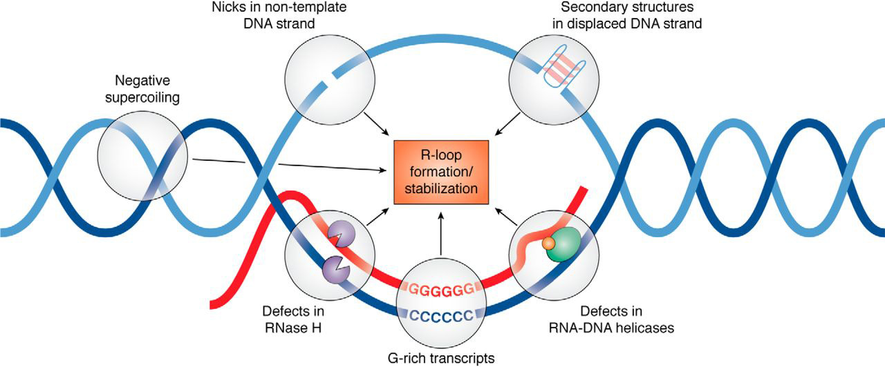

# Introduction

R-loops are three-stranded nucleic acid structures formed from the hybridization of RNA and DNA. With the advent of DNA-RNA immunoprecipitation sequencing (DRIP-Seq) in 2012, it become possible to map R-loop locations throughout the genome [@Ginno2012]. To date, over 40 such studies have been performed, yielding hundreds of R-loop maps across a variety of species. **However, inconsistent data quality has thus far thwarted every attempt to use meta-analysis to draw deeper insights about R-loop biology from this trove of data.**

```{r, fig.cap="Depiction of an R-loop and the factors which may promote them (Hegazy et al., 2020; PMID: [31843970](https://pubmed.ncbi.nlm.nih.gov/31843970/)).", echo=FALSE}
download.file("https://upload.wikimedia.org/wikipedia/commons/d/d3/R-loop_promoting_factors.jpg", destfile = "R-loop_promoting_factors.jpg")

```

**To overcome this limitation, we developed [RLSuite](link_to_rlsuite.com), a suite of tools for R-loop analysis with built-in quality control**. RLSuite includes [RLPipes](https://github.com/Bishop-Laboratory/RLPipes) (a CLI pipeline for upstream R-loop data processing), [RLSeq](https://github.com/Bishop-Laboratory/RLSeq) (R package for downstream R-loop data analysis), and [RLBase](https://github.com/Bishop-Laboratory/RLBase) (a web server and database to explore the results).

{align="right" style="border: none; float: right;" width="256"}

*RLBase* is the first web server and database that provides un-restricted access to **standardized and quality-controlled R-loop mapping data from hundreds of publicly-available samples**. Moreover, process of curating these data has allowed us to confidently identify **R-loop regions (RL Regions), sites of consensus R-loop formation**. The RLBase web server is designed to enable access to all datasets along with the tools necessary to analyze them and evaluate user-supplied data.

Our goal in this document is to **(1) showcase the intended usage of RLBase and (2) address FAQs which may arise when using RLBase**.

<details>
<summary>**Terminology explained**</summary>

In this subsection, we describe the terminology used in *RLBase* to help aid in its usage. 

<h3>Modes</h3>

RLBase contains R-loop mapping data from high-throughput sequencing experiments. There are, to date, over 20 different methods of R-loop mapping included in *RLBase*. To help summarize them, we have provided the following visualization:

```{r, fig.cap="Diagram showing the different R-loop mapping methods which exist. All of these are found in RLBase (except computational methods, SMRF-Seq, and bisDRIP-Seq).", echo=FALSE}
knitr::include_graphics("R-loop mapping methods (primary div)@2x.png")
```


</details>

# Usage

The core features we intend *RLBase* to be used for are:

-   Exploration of R-loop mapping samples ([view](#rlsamples))
    -   Exploration of mapping samples from different modalities
    -   Analysis of sample quality
    -   Analysis of genomic feature enrichment
-   R-loop Region (RL Region) analysis ([link](#rlregions))
    -   Exploration of R-loop regions
    -   Analysis of R-loop region correlation with gene expression
-   User-supplied samples ([view](#userdata))
    -   Analysis of user-supplied data

## Analysis of RLBase samples {#rlsamples}

To view samples in the RLBase database, navigate to the "Samples" tab.

<details>
<summary>**Sample-page components explained**</summary>

In this subsection, we detail the elements of the sample page to help elucidate its usage. 

```{r, fig.cap="Sample page with ", echo=FALSE}
download.file("https://upload.wikimedia.org/wikipedia/commons/d/d3/R-loop_promoting_factors.jpg", destfile = "R-loop_promoting_factors.jpg")

```

</details>

## Exploration of R-loop regions {#rlregions}


# References
